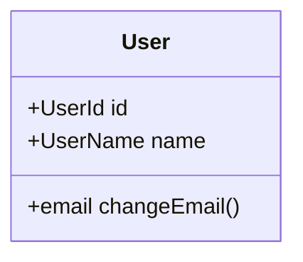
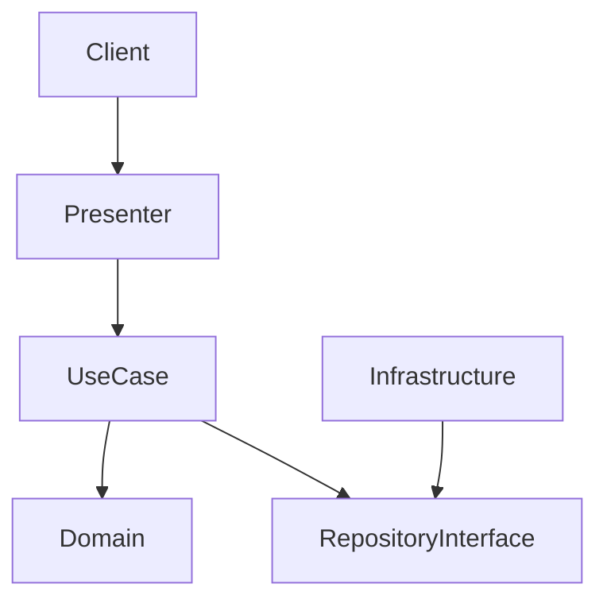

# [Project Name] システム詳細設計書 (System Design Document)

## 1. プロジェクト概要 (Overview)
- **目的**: 
- **対象ユーザー**: 
- **主要機能**: 

## 2. ドメイン設計 (Domain Design / DDD)
### 2.1 境界づけられたコンテキスト (Bounded Contexts)
- **Context A**: ...
- **Context B**: ...

### 2.2 ドメインモデル (Domain Models)

## 3. システムアーキテクチャ (Clean Architecture)
### 3.1 レイヤー構成
- **Presentation Layer**: UI, API Handlers
- **Application Layer**: UseCases
- **Domain Layer**: Entities, ValueObjects, Domain Services (No dependencies)
- **Infrastructure Layer**: DB, External APIs

### 3.2 システム構成図 (Mermaid)

## 4. API インターフェース仕様
...

## 5. UI/UX 設計
...

## 6. 非機能要件
...
