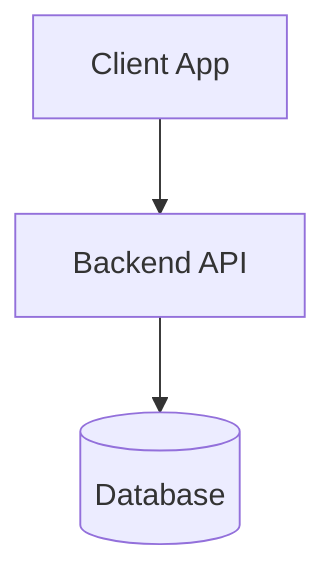
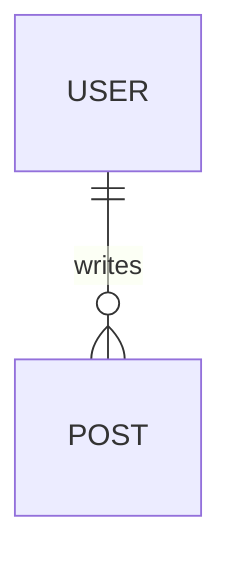

# [Project Name] 詳細設計書 (System Design Document)

## 1. プロジェクト概要 (Overview)
- **目的**: 
- **対象ユーザー**: 
- **主要機能**: 

## 2. システムアーキテクチャ (Architecture)
### 2.1 技術スタック
- Frontend: 
- Backend: 
- Database: 
- Infra/Cloud: 

### 2.2 システム構成図 (Mermaid)

## 3. データモデル設計 (Data Model)
### 3.1 ER図 (Mermaid)

### 3.2 テーブル定義
| テーブル名 | 論理名 | 説明 |
| :--- | :--- | :--- |
| users | ユーザー | ... |

## 4. API インターフェース仕様 (API Specification)
### 4.1 エンドポイント一覧
| Method | URI | 概要 | Request | Response |
| :--- | :--- | :--- | :--- | :--- |
| GET | /api/v1/users | ユーザー取得 | - | User[] |

## 5. UI/UX 設計 (Interface Design)
### 5.1 画面遷移図
- [Screen A] -> [Screen B]

### 5.2 画面詳細
#### [Screen ID] 画面名
- **機能**:
- **UI要素**:

## 6. 非機能要件 (Non-Functional Requirements)
- **セキュリティ**:
- **パフォーマンス**: 
- **可用性**: 

---
*このドキュメントは Claw Template の標準フォーマットに基づいています。*
