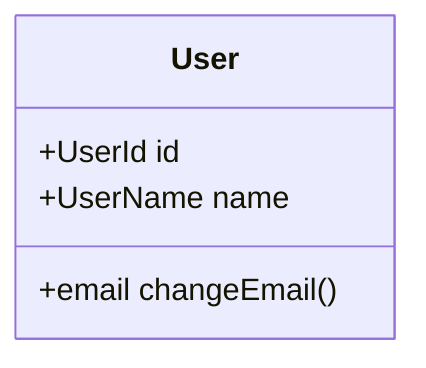
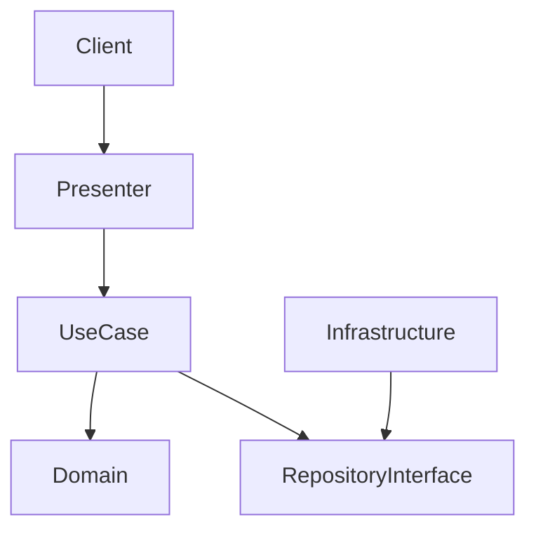

# [Project Name] システム詳細設計書 (System Design Document)

## 1. プロジェクト概要 (Overview)
- **目的**: 
- **対象ユーザー**: 
- **主要機能**: 

## 2. ドメイン設計 (Domain Design / DDD)
### 2.1 境界づけられたコンテキスト (Bounded Contexts)
- **Context A**: ...
- **Context B**: ...

### 2.2 ドメインモデル (Domain Models)


## 3. システムアーキテクチャ (Clean Architecture)
### 3.1 レイヤー構成
- **Domain Layer**: Entities, ValueObjects, Domain Services (No dependencies)
- **Application Layer**: UseCases
- **Interface Layer**: Controllers, Presenters
- **Infrastructure Layer**: DB, External APIs

### 3.2 構成図 (Architecture Diagrams)

#### 物理構成図 (Physical Architecture - Original)
> **Note**: ここには、元仕様書にある物理構成図や詳細なコンポーネント図（ASCIIアート等）を**そのまま転記**してください。省略厳禁。

```text
(Original Diagram Here)
```

#### 論理構成図 (Logical Architecture - Clean Arch)
> **Note**: 上記のコンポーネントをClean Architectureの依存関係ルールに従って整理した図を記述してください。



## 4. API インターフェース仕様
...

## 5. データモデル (Data Models - Implementation Detail)
> **Note**: 元仕様書にある構造体、スキーマ定義、SQLクエリ等のコードブロックは、**要約せずそのまま**ここに記載してください。

### 5.1 データ構造・DTO
...

### 5.2 アルゴリズム・クエリ詳細
...

## 6. 非機能要件 (Non-Functional Requirements)
> **Note**: セキュリティ、パフォーマンス、エンコーディング等の仕様は、リスト項目を**全て一字一句**移植してください。

### 6.1 パフォーマンス・信頼性
...

### 6.2 セキュリティ
...

### 6.3 その他 (文字コード、ログ等)
...
