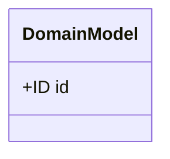
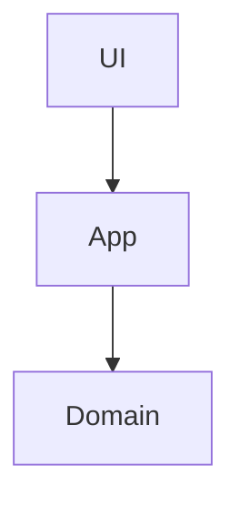

# [Project Name] システム詳細設計書

## 1. プロジェクト概要 (Overview)
- **目的**: 
- **主要機能**: 

## 2. ドメイン設計 (Domain Design / DDD)
### 2.1 境界づけられたコンテキスト
### 2.2 ドメインモデル


## 3. システムアーキテクチャ
### 3.1 技術スタック
### 3.2 構成図
#### 物理構成図 (Original)
```text
(Original Diagram Here)
```
#### 論理構成図


## 4. API インタフェース仕様
## 5. データモデル (Data Models)
## 6. 非機能要件 (Non-Functional)
## 7. エラーハンドリング (Error Handling)
## 8. テスト・移行計画
