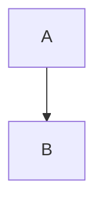

# [Component Name] プログラム仕様書詳細版

## 目次

1. [概要 (Overview)](#1-概要-overview)
2. [アーキテクチャ設計 (Architecture Design)](#2-アーキテクチャ設計-architecture-design)
3. [環境・依存関係 (Environment & Dependencies)](#3-環境依存関係-environment--dependencies)
4. [インターフェース定義 (Interface Definition)](#4-インターフェース定義-interface-definition)
5. [データモデル (Data Models)](#5-データモデル-data-models)
6. [機能詳細 (Functional Details)](#6-機能詳細-functional-details)
7. [非機能要件 (Non-Functional Requirements)](#7-非機能要件-non-functional-requirements)
8. [セキュリティ設計 (Security Design)](#8-セキュリティ設計-security-design)
9. [エラーハンドリング (Error Handling)](#9-エラーハンドリング-error-handling)
10. [テスト・品質保証 (Test & QA)](#10-テスト品質保証-test--qa)
11. [運用・監視 (Operations & Monitoring)](#11-運用監視-operations--monitoring)
12. [付録 (Appendix)](#12-付録-appendix)

---

## 1. 概要 (Overview)

### 1.1 目的 (Purpose)

[このコンポーネントが達成すべき目的を具体的かつ定量的に記述する]

### 1.2 スコープ (Scope)

- **対象 (In-Scope)**: [実装する機能、サポートする環境]
- **対象外 (Out-of-Scope)**: [今回は実装しない機能、前提としない環境]

## 2. アーキテクチャ設計 (Architecture Design)

### 2.1 システム構成図 (System Architecture)



[Mermaid記法やASCIIアートで構成図を記述]

### 2.2 モジュール構成 (Module Structure)

[ディレクトリ構成やパッケージ構成の定義]

## 3. 環境・依存関係 (Environment & Dependencies)

### 3.1 開発言語・フレームワーク

| 項目 | バージョン/要件 | 備考 |
|------|-----------------|------|
| 言語 | | |
| フレームワーク | | |

### 3.2 外部ライブラリ (Libraries)

[主要な依存ライブラリ一覧]

## 4. インターフェース定義 (Interface Definition)

### 4.1 APIエンドポイント (API Endpoints)

| Method | Path | Description |
|--------|------|-------------|
| GET | /api/v1/resource | ... |

### 4.2 入出力仕様 (I/O Specs)

#### 入力 (Input)

- 環境変数
- 引数・パラメータ

#### 出力 (Output)

- 戻り値
- ログ出力形式

## 5. データモデル (Data Models)

### 5.1 データベース設計 (Schema)

[テーブル定義、ER図]

### 5.2 構造体・クラス定義 (Class Definitions)

```go
// 主要なデータ構造の定義
type Example struct {
    ID string `json:"id"`
}
```

## 6. 機能詳細 (Functional Details)

### 6.1 [機能名A]

#### 概要

[機能の説明]

#### ロジック・アルゴリズム

[処理フローの詳細]

### 6.2 [機能名B]

...

## 7. 非機能要件 (Non-Functional Requirements)

### 7.1 パフォーマンス (Performance)

[レスポンスタイム目標、スループット等]

### 7.2 可用性・拡張性 (Availability & Scalability)

[冗長化方針、スケールアウト計画]

## 8. セキュリティ設計 (Security Design)

### 8.1 認証・認可 (AuthN/AuthZ)

[認証方式の詳細]

### 8.2 データ保護 (Data Protection)

[暗号化、マスキング処理]

## 9. エラーハンドリング (Error Handling)

### 9.1 エラーコード体系

| Code | Type | Description |
|------|------|-------------|
| E001 | Auth | ... |

### 9.2 リカバリープラン

[障害時の復旧手順、Circuit Breaker等]

## 10. テスト・品質保証 (Test & QA)

### 10.1 テスト戦略

[単体テスト、結合テスト、E2Eテストの範囲]

### 10.2 CI/CDパイプライン

[自動テスト、Lint、ビルドフロー]

## 11. 運用・監視 (Operations & Monitoring)

### 11.1 ログ設計

[ログレベル、出力フォーマット]

### 11.2 メトリクス・アラート

[監視項目、閾値]

## 12. 付録 (Appendix)

### 12.1 関連ドキュメント

### 12.2 用語集
