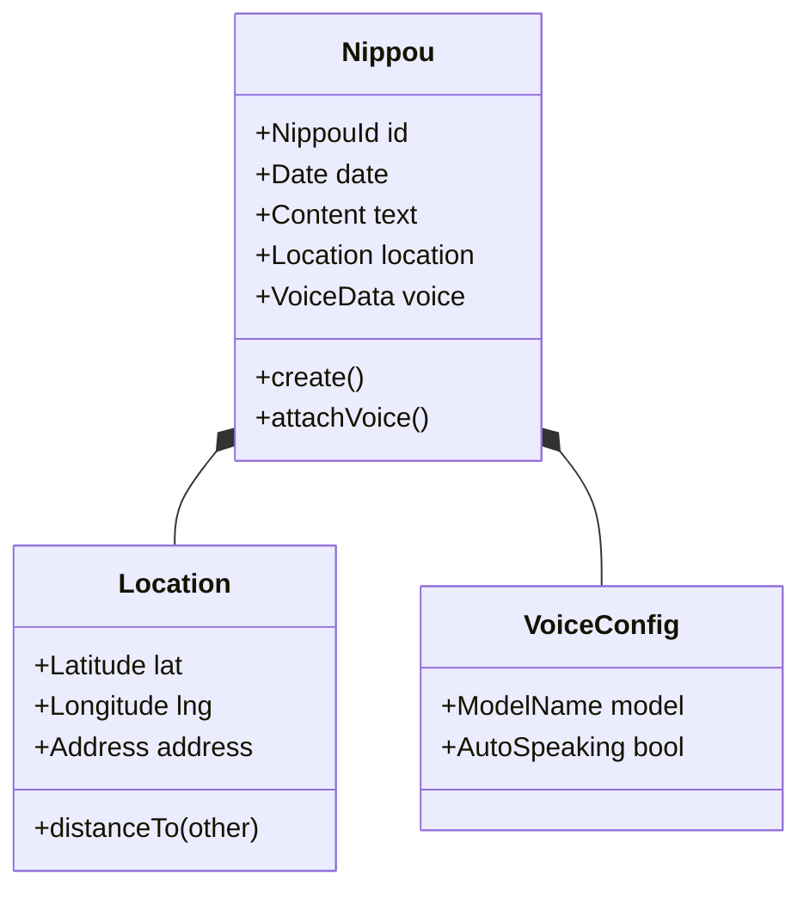
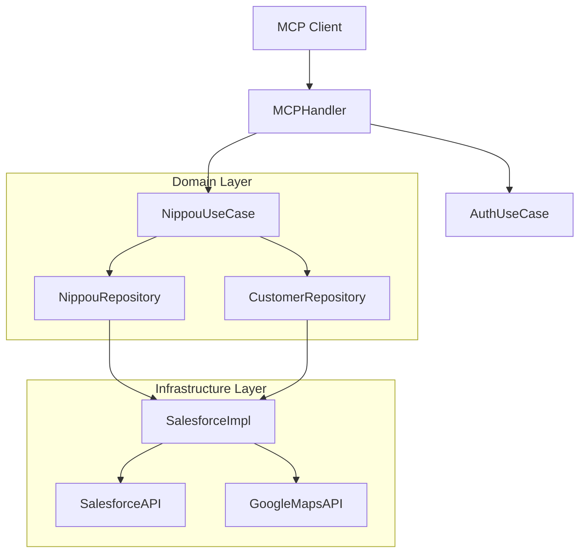

# Salesforce MCP Server (v5.0.0) システム詳細設計書 (System Design Document)

## 1. プロジェクト概要 (Overview)

- **目的**: Model Context Protocol (MCP) サーバーとして動作し、Salesforce REST APIへの接続および拡張業務機能（日報、GPS、音声）を提供する。
- **対象ユーザー**: Claude Desktop等のMCPクライアント利用者、Salesforceを使用するフィールドセールス。
- **主要機能**: OAuth 2.0認証、オブジェクトスキーマ取得、**日報作成（GPS/音声対応）**。

## 2. ドメイン設計 (Domain Design / DDD)

### 2.1 境界づけられたコンテキスト (Bounded Contexts)

- **Auth Context**: OAuth 2.0認証、トークン管理、PKCE。
- **Salesforce Core Context**: スキーマ取得 (Describe)、汎用REST操作。
- **Nippou Context (New)**: 日報管理、位置情報特定、音声データ連携。

### 2.2 ドメインモデル (Domain Models)

#### Nippou Aggregates



#### Auth Aggregates

- **TokenData**: Access/Refresh Token, Expiry (Value Object的に扱うが、IdentityとしてStateを持つ)

## 3. システムアーキテクチャ (Clean Architecture)

### 3.1 レイヤー構成

- **Domain Layer (Pure Go)**: `Nippou`, `TokenData` エンティティ。外部依存なし。
- **Application Layer (Use Cases)**:
  - `CreateNippouUseCase`: GPS座標から顧客を特定し、日報を保存する。
  - `AuthFlowUseCase`: PKCE生成〜トークン交換。
- **Interface Layer (Adapters)**:
  - `MCPHandler`: JSON-RPC 2.0 リクエストをUseCaseに変換。
- **Infrastructure Layer**:
  - `SalesforceClient`: REST API実装, SOQL発行 (`DISTANCE`関数).
  - `GoogleMapsClient`: Geocoding API.
  - `TokenStore`: ファイル/DBへの永続化実装.

### 3.2 システム構成図 (Mermaid)



## 4. API インターフェース仕様 (MCP & HTTP)

### 4.1 MCP Tools

| Tool Name | Description | Arguments |
|-----------|-------------|-----------|
| `auth_start` | Salesforce OAuth認証開始 | - |
| `list_sobjects` | オブジェクト一覧取得 | - |
| `nippou_create` | 日報作成 (GPS/音声) | `date`, `content`, `gps_lat`, `gps_lng`, `voice_mode` |
| `nippou_settings` | 音声設定管理 | `action` |
| `admin_geocode` | 住所座標変換バッチ | `target` |

### 4.2 HTTP Endpoints (Infrastructure)

| Method | Path | Purpose |
|--------|------|---------|
| GET | `/auth/callback` | OAuth Callback |
| GET | `/metrics` | Prometheus Metrics |

## 5. データモデル (Data Models / Implementation Detail)

### 5.1 NippouData (DTO/Infrastructure)

```go
type NippouData struct {
    Date         string      `json:"date"`          // YYYY-MM-DD
    Content      string      `json:"content"`       // 日報本文
    Location     *Location   `json:"location"`      // GPS情報
    VoiceConfig  *VoiceConfig `json:"voice_config"` // 音声設定
    Tags         []string    `json:"tags"`
}
```

### 5.2 Salesforce Query (SOQL)

**Upgrade Note**: ドメインロジック（近隣顧客検索）はRepository内で以下のSOQLを用いて実装される。

```sql
SELECT Id, Name, DEVICE(BillingAddress, GEOLOCATION(:lat, :lng), 'km') dist
FROM Account
WHERE DISTANCE(BillingAddress, GEOLOCATION(:lat, :lng), 'km') < 1
ORDER BY DISTANCE(BillingAddress, GEOLOCATION(:lat, :lng), 'km') ASC
LIMIT 5
```

## 6. 非機能要件 (Non-Functional Requirements)

### 6.1 Performance & Reliability

- **Circuit Breaker**: Salesforce APIエラー率上昇時に遮断 (`ErrCircuitOpen` code 5001).
- **Caching**: Describe情報はメモリキャッシュ (TTLあり/ETag対応).

### 6.2 Security

- **OAuth 2.0**: RFC 7636 (PKCE) 対応。
- **Encryption**: トークンは Argon2 KDF + AES-256-GCM で暗号化して保存。

## 7. テスト・品質保証

- **Unit Test**: Domain/UseCase層のカバレッジ100%を目指す。
- **Lint**: `golangci-lint` (Strict mode).
- **Environment**: Sandboxフラグ (`SF_IS_SANDBOX`) による環境切り替え。

## 8. 移行・互換性 (Migration)

- **Target**: Go 1.21+
- **Version**: v5.0.0 (New Architecture)
