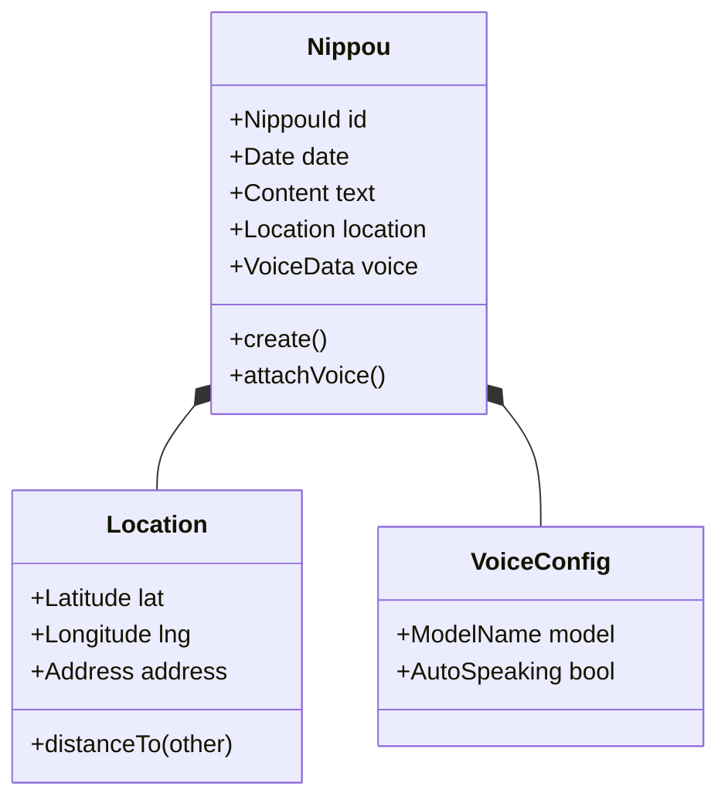
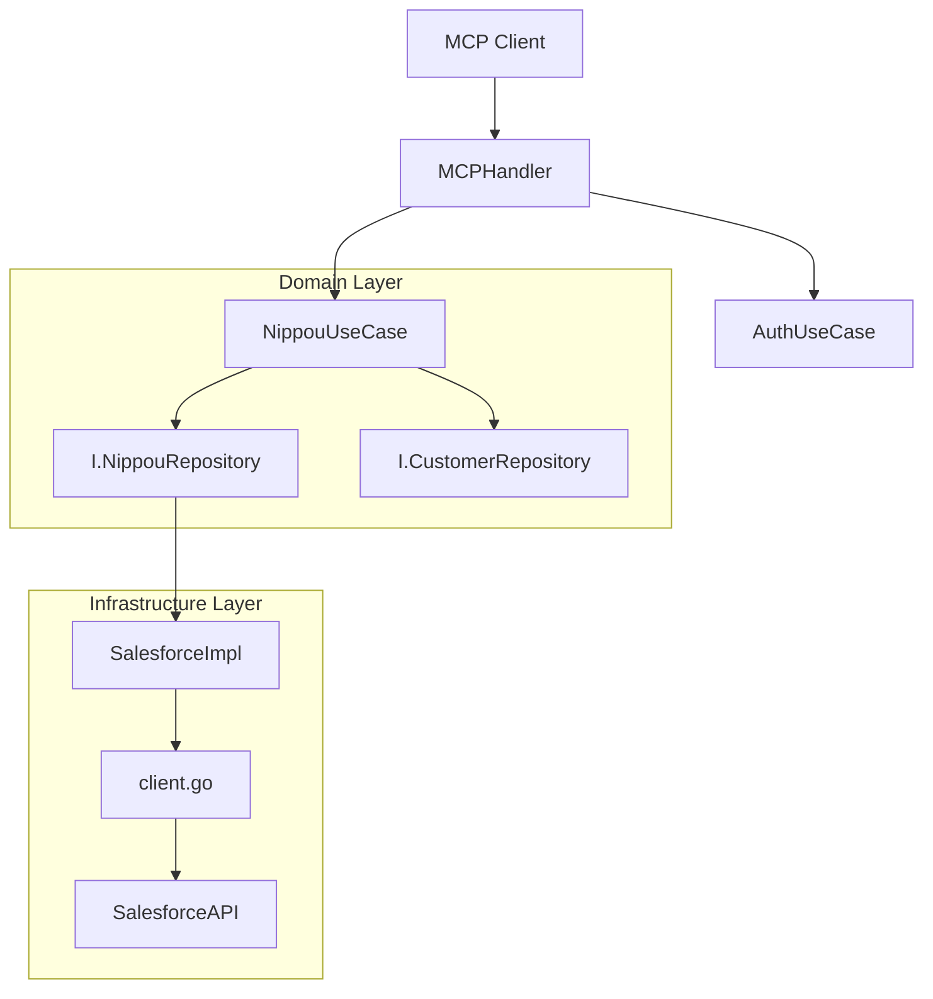

# Salesforce MCP Server (v6.1.0) システム詳細設計書 (System Design Document)

## 1. プロジェクト概要 (Overview)

- **目的**: Model Context Protocol (MCP) サーバーとして動作し、Salesforce REST APIへの接続および拡張業務機能（日報、GPS、音声）を提供する。
- **対象ユーザー**: Claude Desktop等のMCPクライアント利用者、Salesforceを使用するフィールドセールス。
- **主要機能**: OAuth 2.0認証、オブジェクトスキーマ取得(Describe)、**日報作成（GPS/音声対応）**。

## 2. ドメイン設計 (Domain Design / DDD)

### 2.1 境界づけられたコンテキスト (Bounded Contexts)

- **Auth Context**: OAuth 2.0認証、トークン管理、PKCE。
- **Salesforce Core Context**: スキーマ取得 (Describe)、汎用REST操作。
- **Nippou Context (New)**: 日報管理、位置情報特定(GPS)、音声データ連携。



## 3. システムアーキテクチャ (Clean Architecture)

### 3.1 レイヤー構成

- **Domain Layer (Pure Go)**: `Nippou`, `TokenData` エンティティ。外部依存なし。
- **Application Layer (Use Cases)**: `CreateNippouUseCase`, `AuthFlowUseCase`.
- **Interface Layer (Adapters)**: `MCPHandler`.
- **Infrastructure Layer**: `SalesforceClient`, `GoogleMapsClient`.

### 3.2 構成図 (Architecture Diagrams)

#### 物理構成図 (Physical Architecture - Original)
>
> **Note**: 元仕様書の物理構成・プロトコル詳細を維持します。

```
┌─────────────────────────────────────────────────────────────────┐
│                        MCP クライアント                          │
│                    (Claude Desktop等)                           │
└─────────────────────┬───────────────────────────────────────────┘
                      │ JSON-RPC 2.0 over stdio (UTF-8)
                      ▼
┌─────────────────────────────────────────────────────────────────┐
│                     MCP サーバー (Go)                            │
│  ┌─────────────┐  ┌─────────────┐  ┌─────────────────────────┐  │
│  │ MCP Handler │  │ OAuth Mgr   │  │ Salesforce Client       │  │
│  │ - tools     │  │ - prompts   │  │ - REST API (HTTP再利用) │  │
│  │ - logging   │  │ - PKCE      │  │ - describe (ETag対応)   │  │
│  │ - nippou    │  │ - token mgr │  │ - circuit breaker       │  │
│  │             │  │ - rotation  │  │ - composite API         │  │
│  └─────────────┘  └─────────────┘  └─────────────────────────┘  │
└─────────────────────────────────────────────────────────────────┘
                      │ HTTPS (TLS 1.2+)
                      ▼
┌─────────────────────────────────────────────────────────────────┐
│                      Salesforce Platform                         │
│  ┌─────────────────────┐  ┌─────────────────────────────────┐   │
│  │ OAuth 2.0 Endpoints │  │ REST API                        │   │
│  │ - /authorize        │  │ - /sobjects (キャッシュ対応)     │   │
│  │ - /token            │  │ - /describe (ETag対応)          │   │
│  └─────────────────────┘  └─────────────────────────────────┐   │
└─────────────────────────────────────────────────────────────────┘
```

#### 論理構成図 (Logical Architecture - Clean Arch)
>
> **Note**: 上記コンポーネントをClean Architectureで再整理した図です。



### 3.3 インフラ層 (Infrastructure Layer)
>
> **Reverse Sync (2026-01-08)**: 以下のファイル構成で実装完了。

- **client.go**: Salesforce REST API 共通クライアント。認証ヘッダー管理、リトライロジックを含む。
- **models.go**: Salesforce SObjects (`Nippou__c`) と Go 構造体のマッピング定義。
- **nippou_repository.go**: `NippouRepository` の具象実装。SOQL を使用したデータアクセス。

## 4. API インターフェース仕様 (MCP & HTTP)

### 4.1 MCP Tools & HTTP Endpoints

| Tool Name / Path | Description | Arguments / Note |
|---|---|---|
| `auth_start` | Salesforce OAuth認証開始 | - |
| `list_sobjects` | オブジェクト一覧取得 | - |
| `nippou_create` | 日報作成 (GPS/音声) | `date`, `content`, `gps_lat`, `gps_lng`, `voice_mode` |
| `nippou_settings` | 音声設定管理 | `action` |
| `admin_geocode` | 住所座標変換バッチ | `target` |
| `/auth/callback` | OAuth Callback | HTTP GET |
| `/metrics` | Prometheus Metrics | HTTP GET |

## 5. データモデル (Data Models - Implementation Detail)

### 5.1 設定・データ構造体 (Go Structs)
>
> **Strict Retention**: 元仕様書の定義をそのまま維持します。

#### Config Structure

```go
type Config struct {
    Salesforce     SalesforceConfig     `json:"salesforce"`
    Server         ServerConfig         `json:"server"`
    TLS            TLSConfig            `json:"tls"`
    TokenStore     TokenStoreConfig     `json:"token_store"`
    Cache          CacheConfig          `json:"cache"`
    CircuitBreaker CircuitBreakerConfig `json:"circuit_breaker"`
    Metrics        MetricsConfig        `json:"metrics"`
    Tracing        TracingConfig        `json:"tracing"`
    Logging        LoggingConfig        `json:"logging"`
}
```

#### TokenData Structure

```go
type TokenData struct {
    AccessToken              string `json:"access_token"`
    RefreshToken             string `json:"refresh_token"`
    TokenType                string `json:"token_type"`
    InstanceURL              string `json:"instance_url"`
    IssuedAt                 int64  `json:"issued_at"`
    ExpiresIn                int    `json:"expires_in"`
    Scope                    string `json:"scope"`
    UserID                   string `json:"user_id,omitempty"`
    OrgID                    string `json:"org_id,omitempty"`
}
```

#### NippouData (DTO)

```go
type NippouData struct {
    Date         string      `json:"date"`          // YYYY-MM-DD
    Content      string      `json:"content"`       // 日報本文
    Location     *Location   `json:"location"`      // GPS情報 (Optional)
    VoiceConfig  *VoiceConfig `json:"voice_config"` // 音声設定 (Optional)
    Tags         []string    `json:"tags"`          // 関連タグ
}

type Location struct {
    Latitude  float64 `json:"latitude"`
    Longitude float64 `json:"longitude"`
    Address   string  `json:"address,omitempty"` // 逆ジオコーディング結果など
}
```

### 5.2 アルゴリズム・クエリ詳細

#### GPS機能と顧客特定 (Neighborhood Search Logic)
>
> **Logic Preservation**: 元仕様書 5.3.1 の記述を維持。

モバイル利用および将来的な独自SFAへの移行を見据え、GPS座標を**「訪問先（関連顧客）の特定」**に活用する。

1. **近隣顧客検索ロジック**:
   Salesforce SOQLの `DISTANCE` 関数を利用し、現在地から半径1km以内の顧客を検索する。

    ```sql
    SELECT Id, Name, DEVICE(BillingAddress, GEOLOCATION(:lat, :lng), 'km') dist
    FROM Account
    WHERE DISTANCE(BillingAddress, GEOLOCATION(:lat, :lng), 'km') < 1
    ORDER BY DISTANCE(BillingAddress, GEOLOCATION(:lat, :lng), 'km') ASC
    LIMIT 5
    ```

2. **Geocoding (住所座標変換)**:
   `admin_geocode_accounts` ツールにより、Google Maps APIを使用して `Account` の住所から座標を補完・更新する。

#### 音声機能とデータ保存 (Voice Logic)
>
> **Logic Preservation**: 元仕様書 5.3.2 の記述を維持。

将来的な移行（全データダウンロード）を考慮し、Salesforce標準の `ContentVersion` を使用する。

1. **入力**: クライアントから音声データ（Base64）とテキストを受け取る。
2. **保存**:
    - テキスト -> `Nippou__c.Content__c`
    - 音声バイナリ -> `ContentVersion`
3. **紐付け**: `ContentDocumentLink` を作成して両者をリンクする。

#### PKCE Generation

```go
func (g *PKCEGenerator) Generate() (*PKCEParams, error) {
    // S256チャレンジ生成
    verifierBytes := make([]byte, 64)
    rand.Read(verifierBytes)
    verifier := base64.RawURLEncoding.EncodeToString(verifierBytes)
    hash := sha256.Sum256([]byte(verifier))
    challenge := base64.RawURLEncoding.EncodeToString(hash[:])
    return &PKCEParams{
        CodeVerifier: verifier, CodeChallenge: challenge, CodeChallengeMethod: "S256",
    }, nil
}
```

## 6. 非機能要件 (Non-Functional Requirements)

### 6.1 文字エンコーディング (厳守)

- **BOM検出・変換**: 入力ファイルのBOMを適切に処理する。
- **サロゲートペア検証**: 不正なユニコードシーケンスを検知する。
- **Unicode正規化**: **NFC** (Normalization Form C) を適用する。
- **Windowsコンソール対応**:
  - `SetConsoleOutputCP` (CP_UTF8) の自動実行を実装すること。

### 6.2 セキュリティ

- **暗号化**: Argon2 KDF + AES-256-GCM によるトークン暗号化。
- **HTTPヘッダー**:
  - `HSTS`
  - `CSP` (Content-Security-Policy)
  - `X-Frame-Options`
  - `X-Content-Type-Options`
- **プロキシ**: `X-Forwarded-For` の検証と信頼。

### 6.3 運用・監視

- **メトリクス**: Prometheus形式 (`/metrics`)。Salesforce APIコール数、キャッシュヒット率。
- **ログ**: 構造化JSONロギング (Structured JSON Logging)。

## 7. エラーハンドリング (Error Handling)

### 7.1 エラー構造体定義
>
> **Reverse Sync (2026-01-08)**: 実装段階で、アプリケーション層のエラーハンドリングを強化するため以下の `UseCaseError` 体系を導入。

```go
type UseCaseError struct {
    Code    string // INVALID_INPUT, REPOSITORY_ERROR, etc.
    Message string
    Cause   error
}
```

#### UseCase エラーコード一覧

| Code | Description |
|---|---|
| `INVALID_INPUT` | 入力データのバリデーション失敗 |
| `REPOSITORY_ERROR` | 永続化（DB/Salesforce）失敗 |
| `DOMAIN_VIOLATION` | ドメインルール違反（不変条件の不一致） |
| `CONTEXT_CANCELLED` | タイムアウトやキャンセルによる中断 |

### 7.2 リカバリー・Circuit Breaker

Salesforce APIへの過負荷や接続エラー時に遮断を行う。

```go
var ErrCircuitOpen = &AppError{ Code: 5001, Message: "サービスが一時的に利用できません", Retryable: true }
```

## 8. テスト・移行計画 (Test & Migration)

- **Language**: Go 1.21+
- **Lint**: `golangci-lint` (必須)
- **Build**: `make build-all` (Dockerfile / Multi-platform)
- **Sandbox**: `SF_IS_SANDBOX` 環境変数による切り替え。
